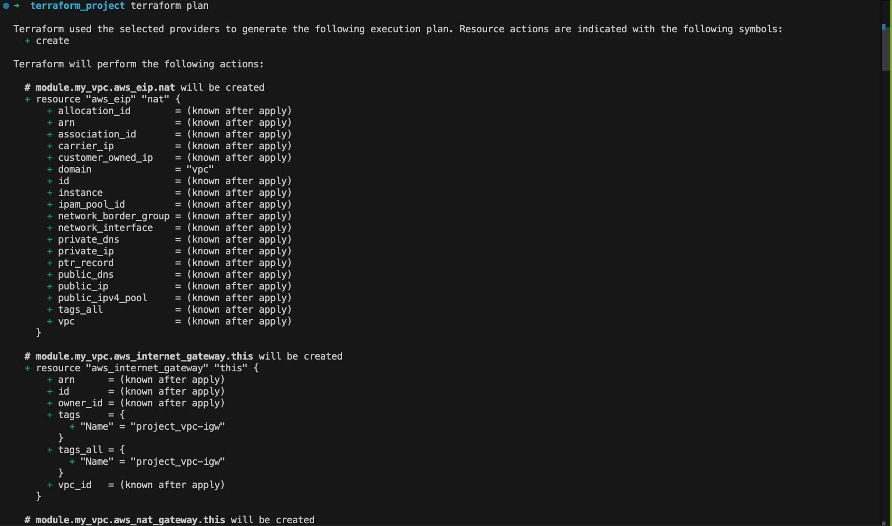

# Custom Terraform AWS VPC Module

This custom Terraform module provisions an AWS Virtual Private Cloud (VPC) with support for public and private subnets, NAT Gateways, Internet Gateways, and tagging across multiple Availability Zones.

---

[](https://www.terraform.io/downloads.html)  
[](https://registry.terraform.io/providers/hashicorp/aws/latest)

## Table of Contents

- [Features](#features)
- [Usage](#usage)
  - [Requirements](#requirements)
  - [Prerequisites](#prerequisites)
  - [Basic Usage](#basic-usage)
- [Inputs](#inputs)
- [Outputs](#outputs)
- [Command Usage](#command-usage)
- [Resource Confirmation](resources-confirmation)
- [Examples](#examples)
- [Contributing](#contributing)
- [Authors](#authors)

---

## Features

- **VPC Foundation**
  - Customizable CIDR block
  - DNS hostnames and resolution support
  - Multi-AZ support

- **Networking Components**
  - Public subnets with Internet Gateway
  - Private subnets with NAT Gateway
  - Elastic IPs for NAT Gateways
  - Route tables and subnet associations

- **Security**
  - Default security groups

- **Tagging**
  - Consistent tagging across all resources
  - Customizable tags per subnet type

---

## Usage

### Requirements

| Name | Version |
|------|---------|
| [Terraform](https://www.terraform.io/) | >= 1.0 |
| [AWS Provider](https://registry.terraform.io/providers/hashicorp/aws/latest) | >= 5.79 |

### Prerequisites

- [AWS Account](https://aws.amazon.com/)
- [Terraform Installation](https://developer.hashicorp.com/terraform/install)
- [AWS CLI Installation](https://docs.aws.amazon.com/cli/latest/userguide/cli-chap-install.html)
- AWS CLI configured with credentials and region

---

### Basic Usage

```hcl
module "vpc" {
  source  = "git::https://github.com/your-repo/terraform-aws-vpc.git?ref=v1.0.0"

  name = "my-vpc"
  cidr = "10.0.0.0/16"
  azs  = ["us-east-1a", "us-east-1b"]

  public_subnets  = ["10.0.1.0/24", "10.0.2.0/24"]
  private_subnets = ["10.0.101.0/24", "10.0.102.0/24"]

  enable_nat_gateway = true
  enable_vpn_gateway = false

  tags = {
    Terraform   = "true"
    Environment = "dev"
  }
}
```

---

### Inputs

| Name | Description | Type | Default | Required |
|------|-------------|------|---------|----------|
| `name` | Name to be used on all resources as prefix | `string` | - | yes |
| `cidr` | The CIDR block for the VPC | `string` | - | yes |
| `azs` | A list of availability zones in the region | `list(string)` | - | yes |
| `public_subnets` | A list of public subnets CIDRs | `list(string)` | `[]` | no |
| `private_subnets` | A list of private subnets CIDRs | `list(string)` | `[]` | no |
| `database_subnets` | A list of database subnets CIDRs | `list(string)` | `[]` | no |
| `enable_nat_gateway` | Should be true if you want to provision NAT Gateways | `bool` | `false` | no |
| `single_nat_gateway` | Should be true if you want to provision a single shared NAT Gateway | `bool` | `false` | no |
| `enable_flow_log` | Whether to enable VPC Flow Logs | `bool` | `false` | no |
| `flow_log_destination_type` | Type of flow log destination (cloud-watch-logs or s3) | `string` | `"cloud-watch-logs"` | no |
| `tags` | Additional tags to apply to all resources | `map(string)` | `{}` | no |

---

### Outputs

| Name | Description |
|------|-------------|
| `vpc_id` | The ID of the VPC |
| `vpc_cidr_block` | The CIDR block of the VPC |
| `public_subnet_ids` | List of IDs of public subnets |
| `private_subnet_ids` | List of IDs of private subnets |
| `database_subnet_ids` | List of IDs of database subnets |
| `nat_gateway_ids` | List of NAT Gateway IDs |
| `internet_gateway_id` | The ID of the Internet Gateway |
| `vpc_default_security_group_id` | The ID of the default security group |

---

### Command Usage

```bash
aws configure
```


---

```bash
terraform init
```


---

```bash
terraform plan
```



```bash
terraform apply
```


---

### Resource Confirmation

- **VPC Confirmation**


- **Subnet Confirmation**


- **NAT Gateway Confirmation**


- **Internet Gateway Confirmation**


- **Route Table Confirmation**


---

## 👥 Collaborators

- **Eric Gomado**
- **Augustine Tetteh Ozor**


